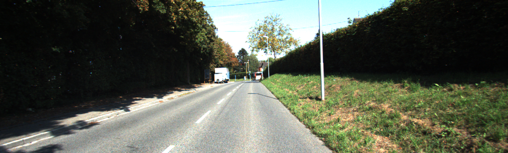

# Footpath segmentation

This repository consists of an approach to segment footpaths by means of 
machine learning. The model architecture used in this project is based on the
architecture introduced in https://github.com/MarvinTeichmann/KittiSeg.
In comparison to the original work, the code is migrated to TensorFlow 2,
using the high-level API called Keras. KittiSeg has been used as part of
MultiNet https://github.com/MarvinTeichmann/MultiNet, described in [[1]](#1).

---
**Note**

Although the purpose and the examples are focused on footpaths/street 
segmentation, any other two-class segmentation can be trained by this approach.

---

# Example results

The following images show street segmentation after training the model with
the Kitti road dataset. The parameters used to accomplish such results are 
given in the train.ipynb and parameters/training.json files. The example images
below are taken from the testing pool of the Kitti road dataset. 

Original Image             |  Predicted Mask           |  Overlay
:-------------------------:|:-------------------------:|:-------------------------:
 |  | 
 |  | 
 |  | 

## References
<a id="1">[1]</a>
M. Teichmann, M. Weber, M. Zoellner, R. Cipolla, R. Urtasun.
MultiNet: Real-time Joint Semantic Reasoning for Autonomous Driving.
In 2018 IEEE Intelligent Vehicles Symposium (IV).
[2018]