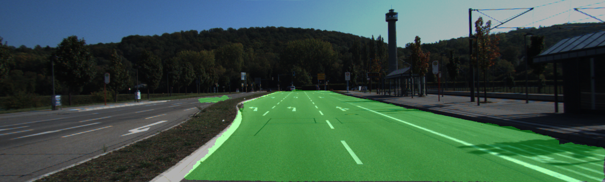

# Footpath segmentation

This repository consists of an approach to segment footpaths by means of 
machine learning. The model architecture used in this project is based on the
architecture introduced in https://github.com/MarvinTeichmann/KittiSeg.
In comparison to the original work, the code is migrated to TensorFlow 2,
using the high-level API called Keras. KittiSeg has been used as part of
MultiNet https://github.com/MarvinTeichmann/MultiNet, described in [[1]](#1).

---
**Note**

Although the purpose and the examples are focused on footpaths/street 
segmentation, any other two-class segmentation can be trained by this approach.

---

# Example results

The following images show street segmentation after training the model with
the KITTI road dataset [[2]](#2). The parameters used to accomplish such
results are given in the train.ipynb and parameters/training.json files.
The example images below are taken from the testing pool of the KITTI road
dataset.

Original Image             |  Predicted Mask           |  Overlay
:-------------------------:|:-------------------------:|:-------------------------:
 |  | 
 |  | 
 |  | 

# Example results after training the model with different datasets

The following images show results after the model has been trained with
different datasets. The original images are taken from the KITTI road dataset,
the Deep Scene, Freiburg Forest dataset [[3]](#3) and an own dataset showing
footpaths around Landsberg am Lech (LaL), a city in Bavaria, Germany. The images
below were not part of the training process!

The models used for this comparisons were trained with similar parameters
which differ only in the number of epochs, the dataset and the trainable layers.
The latter one only effects the models referred to as
_Kitti 120e; DeepScene-Kitti-Mix 120e_ and _Kitti 120e; LaL-Kitti-Mix 120e_. In
those models the Deep Scene and LaL dataset respectively (with a small set of
KITTI images) were trained on top of the model that was trained exclusively with
KITTI images.

The naming convention below is roughly as follows: 
```
DATASET_[NUMBER OF EPOCHS]; (optional) [SECOND DATASET TRAINED ON TOP]_[NUMBER OF EPOCHS]
```

---
**Note**

At the time of the creation of the models, the LaL dataset consisted of 34 
training images, 7 validation images and 16 testing images, showing footpaths
surrounded by fields and forest. Thus a very, very limited dataset that at 
the time was just about to be extended/created properly.

---


### Kitti images

Kitti 120e           |  DeepScene 120e           |  Kitti 120e; DeepScene-Kitti-Mix 120e           |  Kitti 120e; LaL-Kitti-Mix 120e
:-------------------------:|:-------------------------:|:-------------------------:|:-------------------------:
 |  |  | 
 |  |  | 
 |  |  | 
 |  |  | 

### Deep Scene images

Kitti 120e           |  DeepScene 120e           |  Kitti 120e; DeepScene-Kitti-Mix 120e           |  Kitti 120e; LaL-Kitti-Mix 120e
:-------------------------:|:-------------------------:|:-------------------------:|:-------------------------:
 |  |  | 
 |  |  | 
 |  |  | 
 |  |  | 

### LaL images

Kitti 120e           |  DeepScene 120e           |  Kitti 120e; DeepScene-Kitti-Mix 120e           |  Kitti 120e; LaL-Kitti-Mix 120e
:-------------------------:|:-------------------------:|:-------------------------:|:-------------------------:
 |  |  | 
 |  |  | 
 |  |  | 
 |  |  | 


## References
<a id="1">[1]</a>
M. Teichmann, M. Weber, M. Zoellner, R. Cipolla, R. Urtasun.
MultiNet: Real-time Joint Semantic Reasoning for Autonomous Driving.
In 2018 IEEE Intelligent Vehicles Symposium (IV).
[2018]

<a id="2">[2]</a>
KITTI road - http://www.cvlibs.net/datasets/kitti/eval_road.php

<a id="3">[3]</a>
DeepScene - http://deepscene.cs.uni-freiburg.de/